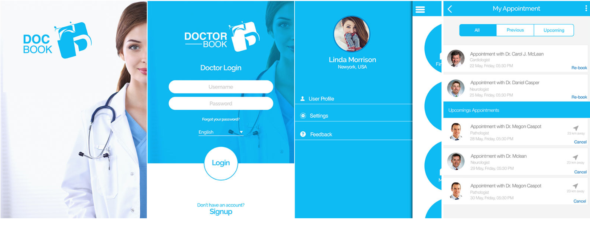

# Dr. Book
Dr. Book enable the users to find the right Doctors, Labs, Pharmacies and Hospitals/Clinics. The application will allow users to find different doctors working at different departments of different hospitals and book appointments with them if required. The users can browse qualified doctors based on their area of specialization, location, hospitals and insurance companies. There is efficient class reminder system for both, patients and doctors. There is feasibility to the patients to set reminders for their medicines through Drawers

# Role
Design and build iPhone application from scratch. Application is written in Swift Language

# Reference

[Dr Book](http://www.appshah.com/dr-book/)
