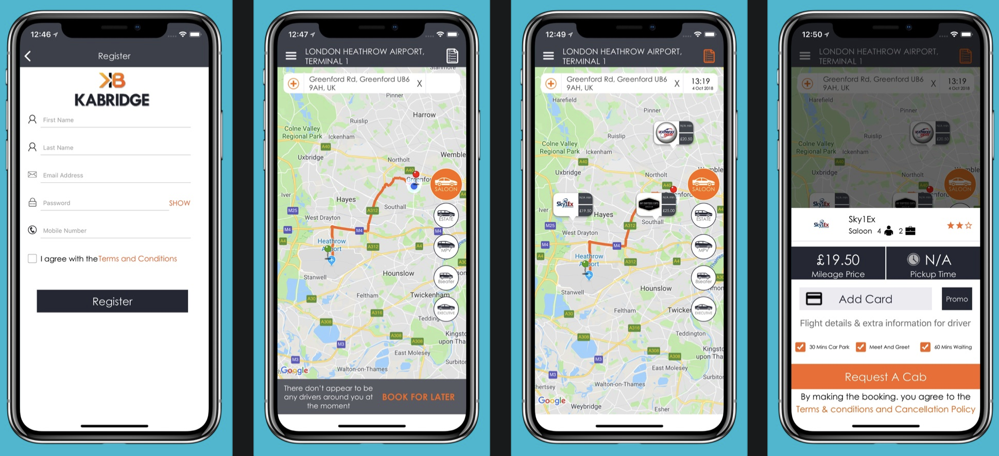
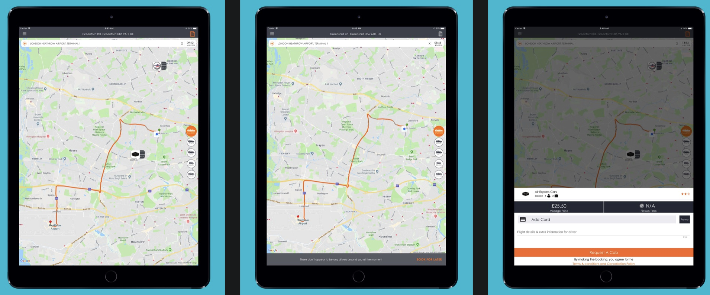

##### UK based Taxi Application
Kabridge is a complete, easy to use and reliable application that allows you to compare travel fares from different private
hire operators so that you can book the best option possible. Now no need to go anywhere else as Kabridge is here to book your fleet. With the possibility of getting quotes from different vendors under one roof, booking has been simplified.

Whether you want to book a luxurious drive or an economical one, Kabrdige covers all to satisfy you and find the best fleet
for you that match your needs. You can also choose any car of your preference that is nearby. Kabridge is a complete, easy to
use and reliable application that allows you to compare travel fares from different private hire operators so that you can 
book the best option possible. Now no need to go anywhere else as Kabridge is here to book your fleet. With the possibility of getting quotes from different vendors under one roof, booking has been simplified.

## Role
I have worked on Kabridge single handedly, complete more than 20% funtionalities and push to AppStore. Basically previous iOS software engineer left the company and i joined. My responsibility is to developer remaining functionalities, remove issues and push to AppStore.

## Resources
[Kabridge](https://www.kabridge.com/)

[Kabridge AppSore](https://apps.apple.com/us/app/kabridge/id1237691328)
