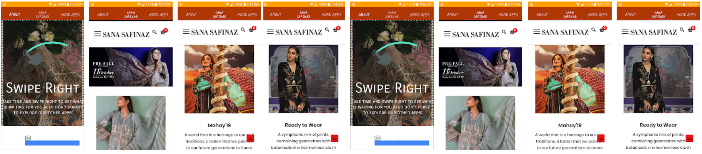

# SANA SAFINAZ
Sana Safinaz Is Part Of SS Fashion Resources. Present In Pakistan Since 1989. We Are The Country’s Only Premier Luxury Retailer Offering Elegant Ready-To-Wear And Fabrics, Tastefully Printed And Embroidered Along With Avant-Garde Silhouettes To Suit The Modern Woman.

Our Online Portal Caters To All Women Clothing Needs Offering Eastern Ready-To-Wear, Unstitched Packaged Suits, Accessories And Footwear, Delivered In Impeccable Packaging And Unrivalled Customer Care To Your Doorstep Via Worldwide Express Delivery.

All Materials, Including Illustrations, Photographs, Products, Images, Artwork, Designs, Texts, Graphics, Logos, Button Icons, Images, Audio Clips And Software (Collectively “Content”) Appearing On This Website Are Owned Or Controlled By SanaSafinaz.Com And Are Protected By Worldwide Trademark And Copyright Laws. The Content Of The Website, And The Website As A Whole, Are Intended Solely For Your Personal, Noncommercial Use Of The Website. You May Not Download Content From This Website, Or Otherwise Modify, Obscure Or Delete Any Copyright Or Other Property Notices On The Website. No Right, Title Or Interest In Any Materials And Software.

Sana Safinaz Makes No Representation Whatsoever Regarding The Content Of Any Other Websites Which You May Access From This Website. When You Access Any Other Website Than This Website, Please Understand That It Is Independent From Sana Safinaz And That Sana Safinaz Has No Control Over The Content On That Website. A Link To Any Other Website Does Not Mean That Sana Safinaz Endorses Or Accepts Any Responsibility For The Content Or Use Of Such Website.

# Role

Design and develop Sana Safinaz's iOS app as a team member and push to AppStore. Application is 
written in Swift language

# Reference

[Sana Safinaz](https://www.sanasafinaz.com/)

[Sana Safinaz AppStore](https://itunes.apple.com/pk/app/sana-safinaz/id1123324545?mt=8)
