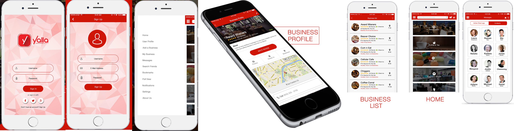

# YALLA
Yalla Mobile app will allow users to locate various small and medium scale business around their vicinity via GPS functionality. With a few taps users could easily find
& navigate their way to restaurants, motels, grocery stores or other retail or wholesale businesses. Additionally users will also have the ability to rate businesses, post and validate reviews and simultaneously check-in at different businesses and restaurants. Users can also read reviews and comments posted by other users to make better selections with their purchasing and dining. Furthermore users will also have the option of creating their own polls to get advice and suggestions from other users about various deals and services offered by vendors.

# Role
Design and build iPhone application from scratch. Application is written in Swift Language

# Reference

[Yalla](http://www.appshah.com/Yalla/)